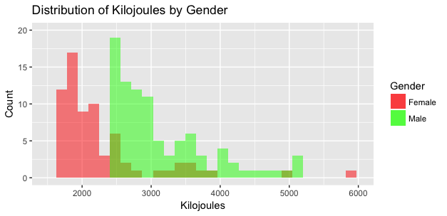
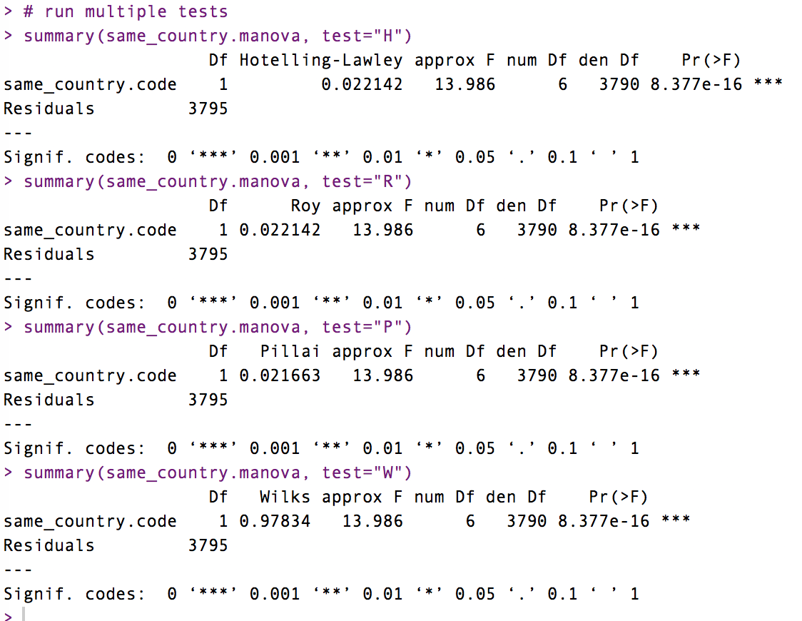

<html class="gr__leontaolong_github_io"><head><meta content="text/html; charset=UTF-8" http-equiv="content-type"></head><body class="c20" data-gr-c-s-loaded="true">

Leon Long

Data Science Project

University of Washington Information School

Strava Data Analysis Report

<h1 class="c14" id="h.arolcxe0i15c">Questions of Interests</h1>
Strava is a software that tracks athletic activity via satellite navigation and connects athletes through its social network platform. For this project, we have access to the Strava API, which gives us various user and athletic activity related data. Based on the Strava activity data, we have two questions of interest to be answered through this analysis:
<ol class="c17 lst-kix_a341pg3d3rb0-0 start" start="1"><li class="c18">&nbsp;Do men tend to exercise more intensely (taking into account both distance and speed) than women?</li><li class="c18">Do athletes tend to exercise more intensely when they are in different countries from their origin countries. </li></ol><h1 class="c14" id="h.vzetrcur9ycz">Exploratory Data Analysis</h1>
Prior to further data wrangling and analysis, we need to get an overview of our dataset by exploring dimensions and number of observations included: there are 8093 observations and 53 variables. By taking a closer look at the list of variables and putting them into two main categories--user-related profile data&nbsp;and activity-related athletic data--we are able to better navigate ourselves and find the most related ones from other trivial and distracting variables.

Given the questions of interests, I selected 12&nbsp;mostly-related variables to further explore the datasets: &nbsp;"athlete.country", "athlete.sex", "average_heartrate", "max_heartrate", "average_speed", "max_speed", "distance", "moving_time", "elapsed_time", "kilojoules", "location_country", and "total_elevation_gain". &nbsp;(Figure 1)

Figure 1

Figure 1&nbsp;is a snippet of&nbsp;15&nbsp;rows of data. As it shows, there are multiple “NA” values in the dataset, most of which are in "average_heartrate", "max_heartrate", and “kilojoules”. This makes sense since most of the mobile devices have no built-in heart rate tracking feature. In order to figure out how would the missing values affect our further analysis, I found that there were only 1120 /8093 rows of data with all variables in place, and by removing "average_heartrate", "max_heartrate", we got 3824 complete rows of observations.

To answer the questions of interests, I specifically assessed the key variables--there are 4084 male athletes and 3824 females athletes. These relatively even population sizes ensure the accuracy of later analysis. In contrast, only 856 /8093 activities occurred in different countries from the athletes’ origin countries.

Besides, we also plot out the distributions of key variables across genders:

Based the the above two overall distribution, we can see that across all activities, male athletes tend to have large average and maximum speeds&nbsp;compared to female athletes. 

The Kilojoules graph shows a clear trend that the male athletes are further distributed along the x-axis (Kilojoules) and the Distance graph shows a slight shift between the male and female distributions as well. Solely based on these four distributions of key variables, we can see a potential trend that males tend to exercise more intense than women. 
<h1 class="c14" id="h.6iy8hdw3962i">Data Preparation</h1>
To prepare for further statistical modeling, I cleaned and transformed the data so it best serves our later analysis and choice of statistical modeling method. 

Since there are only 856 /8093 fully-complete observations, and heart rate related data are missing the most, I decided to remove "average_heartrate", and "max_heartrate"&nbsp;from our data frame. Furthermore, since “kilojoules” seemed to be a very fair indicator of the activity intensity, I decided to include it in our analysis even though we need to give up some portion of our dataset. I also made sure that other missing-value and duplicate rows were removed from our clean dataset.

When it comes to intensity, I realized that moving_time&nbsp;and elapsed_time themselves, among the other variables, seemed to be a little irrelevant. I decided to create another aggregated variable named moving_ratio&nbsp;that, which is defined as moving_time / elapsed time, which indicated how active the athlete is in each activity session. Moreover, I created another variable same_country, which indicates whether the activity occurred in the same country from the athlete’s origin country. 

On top of that, I also transformed two categorical variables into factors as &nbsp;gender.code&nbsp;and same_country.code for future convenience when it comes to statistical modeling. Here is the clean data after preparation (Figure 2):

Figure 2
<h1 class="c14" id="h.ygyhbgu36eia">Statistical Modeling</h1>
The major question that we want to answer involves how intense each athletic activity is, which brings us to defining the word “intensity”. As we discussed previously, we consider more than one variables as our indicators of intensity including average and max speed, distance, kilojoules, moving_ratio, and etc, which means that we have multiple dependant variables corresponding to the independent variable--athelete.sex. In this situation, after some researches, I decided to use MANOVA&nbsp;as our statistical modeling method. 

MANOVA is a procedure for comparing multivariate&nbsp;sample means. As a multivariate procedure, it is used when there are two or more dependent variables,&nbsp;and is typically followed by significance tests involving individual dependent variables separately. (Warne, R. T. 2014, Stevens, J. P. 2002)

In an MANOVA, we examine for statistical differences on multiple continuous dependent variables, bundled together into a weighted linear combination or composite variable, by an independent grouping variable. In this case, the multiple continuous dependent variables are those potential indicators of activity intensity. We were examining whether the athelete.sex&nbsp;determines the activity intensity, which is represented by those dependent variables.

However, since MANOVA test only yields whether there’s a difference between the two gender groups, to get the direction of correlation, in other words, do men tend to exercise more intensely than women, I would fit linear regression model on each dependent variable. 
<h1 class="c14" id="h.8e7tr09ekkb4">Results</h1>
As we performed the MANOVA tests on athelete.sex&nbsp;and same_country for Question 1 and Question 2, we found that both p-values are very significant, which mean that there are statistical differences&nbsp;on activity intensity&nbsp;across two gender groups&nbsp;and&nbsp;whether the activity occurred in the same country with the athlete's origin country. 

<h1 class="c14" id="h.zz4dnh1q62y"></h1>
I further evaluated each indicator of activity intensity to see how strong each of them is related to athelete.sex&nbsp;and same_country.

&nbsp; &nbsp; &nbsp; &nbsp; &nbsp; &nbsp; &nbsp; &nbsp; 

Then, I only looked at the variables with&nbsp;‘***’ &lt; 0.001 p-value and fit linear regression model on each of them with athelete.sex and same_country.

&nbsp; &nbsp; 

We can see that for all intensity indicators, same_country.codeTrue is always negative, which means that if the athlete is in the same country, he or she tends to exercise less intensively. For all intensity indicators, in general, gender.codeM is positive and gender.codeF is negative, which means that males tend to exercise more intensely than females. 
<h1 class="c14" id="h.ag5yabwt1vi0">Discussion</h1>
Based on our statistical modeling and analysis, we can conclude that men do tend to exercise more intensely than women and athletes do tend to exercise more intensely when they are in different countries from their origin countries. This results align with the assumptions we made based on the initial distributions. I think the statistical model is very accurate as we performed other tests. One of the limitation I was concerned with was that there are different types of activities, distance, elevation_gain, speed, vary from activity to activity and it’s very hard to define and measure “intensity”. However, since the number of males and females are very close, by including those related variables, we can just neglect the activity types, and that’s why we employed MANOVA. This finding may be interesting to sociologist, nutritionist, and athletes in general to further explore the underlying principles and implications.
<h1 class="c14" id="h.u4frjny03mps">&nbsp; &nbsp; </h1><h1 class="c14" id="h.mvv5l7pqo7yv">Works Cited</h1>
&nbsp;Warne, R. T. (2014). <a class="c22" href="https://www.google.com/url?q=http://pareonline.net/getvn.asp?v%3D19%26n%3D17&amp;sa=D&amp;ust=1511861580262000&amp;usg=AFQjCNF68kXh-lM7FT5tzquNAWKsMR0Zxw">"A primer on multivariate analysis of variance (MANOVA) for behavioral scientists"</a>. Practical Assessment, Research &amp; Evaluation. 19 (17): 1–10.

Stevens, J. P. (2002). Applied multivariate statistics for the social sciences. Mahwah, NJ: Lawrence Erblaum.
</body></html>
